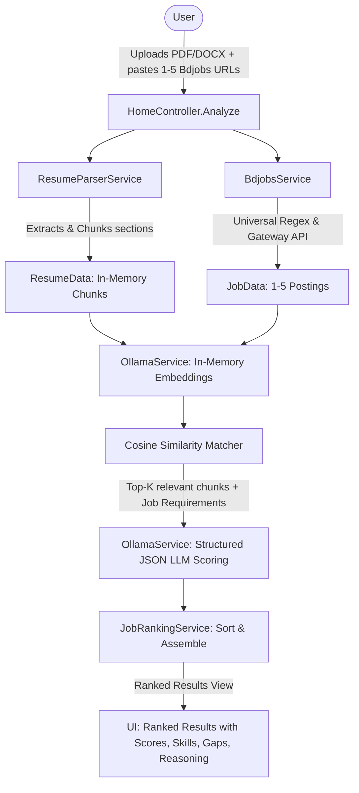

# AI Job Finder 🎯

An in-memory, privacy-first **ASP.NET Core 10 MVC** web application that analyzes candidate resumes against live **Bdjobs.com** job postings. It extracts job specifications, performs in-memory section chunking and vector embeddings, retrieves relevant qualifications via cosine similarity, and scores each opportunity with a local **Ollama LLM** — completely stateless with zero data persistence.

---

## ✨ Key Features

- **📄 Universal Resume Parsing**: Extracts structured text from **PDF** (`PdfPig`), **Word DOCX** (`OpenXml`), and **TXT** files (up to 5MB). Automatically identifies scanned/image-only PDFs and flags them gracefully.
- **🧩 Section-Aware Chunking**: Intelligently segments resumes into semantic blocks (`SKILLS`, `EXPERIENCE`, `EDUCATION`, `PROJECTS`, `SUMMARY`).
- **🌐 Bdjobs Gateway Integration**: Extracts Job IDs from any URL format (`/h/details/1519924`, `?id=1519924`, `/jobs/1519924`, or bare digits) and fetches live structured job data from the internal Bdjobs Gateway API.
- **🧠 In-Memory RAG Pipeline**:
  - Embeds candidate sections and job descriptions on the fly using Ollama (`nomic-embed-text` / `mxbai-embed-large`).
  - Computes cosine similarity in-process to retrieve the top relevant qualifications for each specific job.
- **🤖 Dual Scoring Engine**:
  - **Local Ollama LLM** (`llama3.1:8b`, `qwen2.5:7b`): Structured JSON evaluation with temperature 0.1 for consistent, reproducible scoring and anti-prompt-injection boundaries.
  - **Smart Heuristic Fallback**: Generates natural, human-like 2-3 sentence recruiter evaluations and skill gap analysis even when Ollama is offline.
- **🔒 100% Stateless**: All file contents, extracted strings, vector arrays, and responses exist strictly in-memory during the request lifecycle. Nothing is saved to disk or database.
- **🎨 Modern UI/UX**: Dual-panel drag-and-drop upload, live ID detection badges, animated pipeline progress modal, visual score meters, matched skills pills, and dark/light theme switching.

---

## 🏗️ Architecture Overview



---

## 🚀 Quick Start

### 1. Prerequisites
- [.NET 10 SDK](https://dotnet.microsoft.com/download/dotnet/10.0)
- Optional: [Ollama](https://ollama.com/) (for local LLM inference)

### 2. Run Locally
```bash
# Clone the repository
git clone <repo-url>
cd FindJob

# Restore & run
dotnet run --project FindJob/FindJob.csproj
```
Open your browser at `http://localhost:5210` or `https://localhost:7210`.

### 3. (Optional) Run with Local Ollama
```bash
# Pull recommended models
ollama run llama3.1:8b
ollama pull nomic-embed-text
```

---

## 🐳 Docker Deployment

You can containerize and run the application with Docker:

```bash
# Build the Docker image
docker build -t aijobfinder:latest .

# Run container on port 8080
docker run -p 8080:8080 aijobfinder:latest
```

Access the app at `http://localhost:8080`.

---

## 🧪 Running Automated Tests

```bash
dotnet test
```

Includes 21 automated unit and integration tests covering URL regex extraction, live Bdjobs gateway parsing, cosine similarity vector math, section chunking, and ranking logic.

---

## 📜 License

MIT License.
